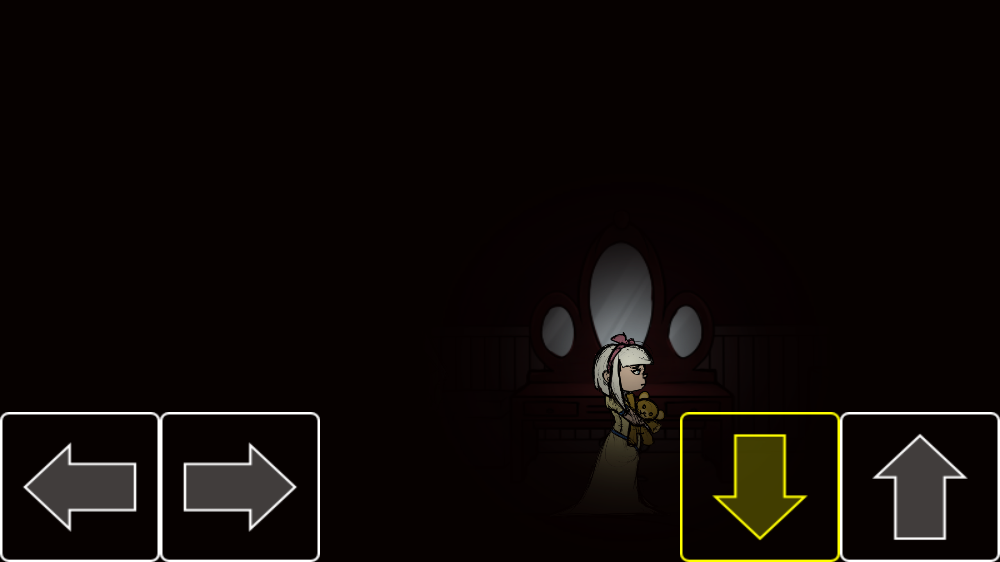

## Imperception UWP v1.0.1 (alpha)

This is my fork of the desktop monogame demo project by Lexyvil:
https://lexyvil.itch.io/imperception

My main goal is/was: adapdation for W10M (Astoria included). 
And second (goal): explore "virtual pad" hiding problem on Astoria.

## Screenshots

## My 2 cents (status)
- Project tuned on(to) tweaked Monigame.Framwork (and "firm" v3.7.xx.xx)
- Some project research and minimal "re-dev" (kbd control)
- W10M UWP "theme" added. :)

## A few words (description) frow the author(original)

What was supposed to be a short game for a MonoGame game jam had turned out to be an idea for a potential future project. This demo made for the game jam was not finished on time,  sadly, due to being too ambitious and I did not estimate my time well for my first jam. But the proof of concept is there at least~

### Controls
- Enter: Bypass pre-game screens.
- Up: Enter Doors.
- E: Action Key.

### Goals
- Add more rooms
- Add more gameplay elements (Other than simply roaming and avoiding death)
- Improve AI
- Add story elements
- Add more sound effects for everything

### Gamedev/Design
- Coder: Lexyvil
- Art: Garuu, Nene

## Reference(s)
- [Lexyvil](https://lexyvil.itch.io/) Lexyvil at itch.io (author of imperception game demo)
- [Imperception](https://lexyvil.itch.io/imperception) MonoGame Game Jam of 2018. Theme: Footstep.

## ..
As is. No support. RnD only. DIY.

## .
[m][e] 2024

